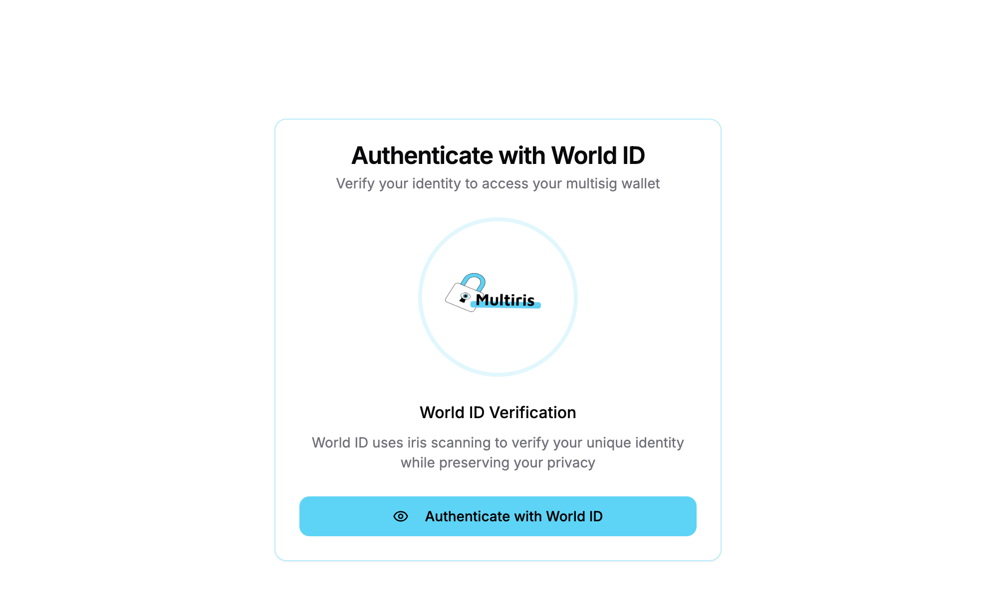

# Multiris - Secure Multisig Wallet with World ID Authentication

Multiris is a secure, user-friendly multisignature wallet application that integrates World ID’s iris-based biometric verification to ensure only real humans can create and manage wallets. By combining the robust security of multisignature technology with unique human authentication, Multiris offers a groundbreaking solution for safeguarding digital assets and enabling trusted governance in decentralized systems such as Web3 applications, exchanges, and DAOs.

## Key Features

- **World ID Authentication**: Verifies users as unique humans through iris-based biometric verification, preventing Sybil attacks.
- **Multisignature Security**: Requires multiple approvals for transactions, eliminating single points of failure.
- **Customizable Governance**: Allows users to define personalized approval thresholds for transactions.
- **Mobile-First Design**: Optimized for smartphones with an intuitive, accessible interface.
- **Testnet Integration**: Supports safe testing on the Sepolia testnet before managing real assets.

## Screenshots

### Authentication Screen


### Wallet Creation


### Dashboard


### Transaction Details


### Members Management


## How It Works

Multiris provides a streamlined, secure approach to digital asset management:

1. **Authentication**: Users verify their identity with World ID, ensuring one person cannot create multiple accounts.
2. **Wallet Creation**: Set up a multisignature wallet and add trusted co-signers.
3. **Threshold Configuration**: Define the number of approvals required for each transaction.
4. **Transaction Management**: Initiate, review, and approve transactions with multi-party verification.
5. **Activity Tracking**: Monitor all pending and completed transactions in a unified dashboard.

## Technology Stack

Multiris is built with modern, cutting-edge technologies:

- **Frontend**: Next.js, React, TypeScript
- **UI Components**: Tailwind CSS, Radix UI
- **Blockchain Integration**: Viem
- **Authentication**: World ID (via MiniKit integration)

## Getting Started

To run Multiris locally:

```bash
# Clone the repository
git clone https://github.com/yourusername/multiris.git
cd multiris
```

# Install dependencies
npm install --legacy-peer-deps

# Start the development server
npm run dev
World ID Integration
Multiris leverages World ID for unique human verification, mitigating Sybil attacks where a single entity could manipulate approvals with multiple accounts. Key integration components include:
MiniKitProvider: Manages connectivity with the World App.

VerifyWithWorld: Handles the verification workflow.

Authentication data is securely stored and associated with each user’s wallet.

Building for Production

# Build the application
npm run build

# Start the production server
npm start
Deploying to Vercel
Multiris is optimized for deployment on Vercel:
Connect your repository to Vercel.

Set required environment variables in the Vercel dashboard.

Deploy the application.

Project Structure
multiris/
├── app/                   # Next.js app directory
│   ├── auth/              # Authentication pages
│   ├── dashboard/         # Main dashboard
│   ├── create-wallet/     # Wallet creation workflow
│   └── transaction/       # Transaction management
├── components/            # Reusable React components
├── hooks/                 # Custom React hooks
├── lib/                   # Utility functions
├── public/                # Static assets
└── types/                 # TypeScript definitions

## Problem & Solution
Problem: Digital security in blockchain remains fragile, with single points of failure and fraud causing significant losses (e.g., Mt. Gox: 850,000 BTC lost; QuadrigaCX: C$250M inaccessible). Existing solutions lack robust identity verification and collaborative governance.
Solution: Multiris integrates multisignature wallets with World ID, ensuring secure, human-verified transactions and governance, protecting against fraud, unilateral actions, and Sybil attacks.
## Impact
Multiris raises the standard for security and trust in decentralized systems by offering a mobile-optimized, human-verified platform for managing digital assets, making it ideal for DAOs, financial platforms, and Web3 communities.


